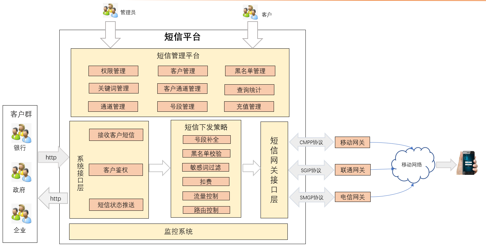
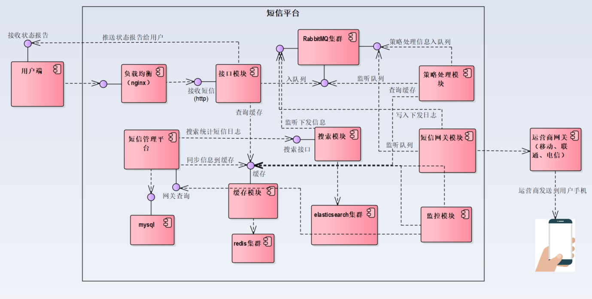

短信平台
-------
产品分五大子系统：短信管理平台、系统接口层、短信下发策略、短信网关接口、监控系统，分别完成不同的功能，也可组合成复杂的综合系统，如下图1所示。接入子系统的功能是通过协议接入第三方客户和推送状态报告，采用异步通信机制，状态报告数据直接推送给对方；短信管理平台提供权限管理，客户管理，黑名单和敏感词管理以及下发日志统计查询等功能。短信下发策系统主要是对接收到的短信进行黑名单、敏感词、流量、路由等方面的控制和过滤。短信网关接口系统能够接中国移动的企信通CMPP2、CMPP3.0短信网关、中国联通的SGIP短信网关、中国电信的SMGP网关，也可以接入其他非标准接口或网关。短信网关接口系统支持多个通道的整合管理，机构可以同时使用多个通道，只需事先定义好路由策略，即可自动路由分拣。不同通道对接模块可以分布式部署，亦可集中部署，方便灵活。

## Features

  基于Spring Cloud Finchley微服务框架

* 基于Eureka的服务管理
* 异步编程与高并发多线程处理技巧
* 基于Servlet3.0实现接口异步处理
* 基于Shiro实现客户精细化权限管理
* 基于HttpClient加多线程实现消息推送
* 基于分布式任务框架Elastic-Job实现高可用监控
* 短信下发策略模块使用责任链框架解耦业务，实现业务可定制可拨插的编程
* 基于RabbitMQ日志收集以及各系统间解耦
* 基于Elasticsearch实现短信日志搜索与统计
* 基于Netty实现各运营商网关的Socket高性能异步通讯
* 基于Echarts展示统计图表
* 前端采用VUE框架

## 逻辑架构图

## 组件图

## 组件
sms-platform由：

- sms-platform-common
- sms-platform-cache
- sms-platform-eureka
- sms-platform-gateway
- sms-platform-interface
- sms-platform-monitor
- sms-platform-search
- sms-platform-strategy		
- sms-platform-webmaster

组成

### sms-platform-eureka
Eureka服务发现管理,支持高可用配置。

### sms-platform-cach
提供基本的缓存操作接口，缓存管理平台同步过来的黑名单、敏感词、通道路由、客户信息、充值、扣费等，提供缓存查询接口。

### sms-platform-gateway
  监听短信下发日志，把日志写到MQ,从状态报告队列监听状态报告，更新下发日志状态，提供短信搜索与统计接口给运营管理平台使用。  

### sms-platform-interface
接口模块实现了与API客户端的对接，实现了对接口发送短信的校验与预处理，推送状态报告给客户.

### sms-platform-monitor
监控网关下发队列，如果下发队列积压超出一定值就报警，有可能是网关出问题，不从队列取值或发送缓慢，或客户有超大数据发送，需要运营人员排查关注

监控用户客户费用不足一定的值，比如小于1000块钱，就提醒用户充值，每天早 9天定时排查一次

### sms-platform-search
监听短信下发日志，把日志写到MQ,从状态报告队列监听状态报告，更新下发日志状态，提供短信搜索与统计接口给运营管理平台使用。  

### sms-platform-strategy
对接收到的短信进行号段补全、黑名单、敏感词、流控、扣费、路由等方面的控制和过滤,各个过滤器之间要做到解耦，可以通过配置文件来动态配置，当需要去掉某个过滤器的时候不需要更改程序，只需要改一下配置文件即可.

### sms-platform-webmaster
短信管理平台实现权限管理、客户管理、黑名单管理、敏感词管理、短信通道管理、客户通道管理、充值和号段管理、查询统计、短信下发等功能。

# 千锋Java教研院技术交流QQ群

完整代码与资料下载，问题交流：

## 参与贡献

​      1.千锋Java教研院-大杜
​      2.千锋Java教研院-老魏
​      3.千锋Java教研院-老吕